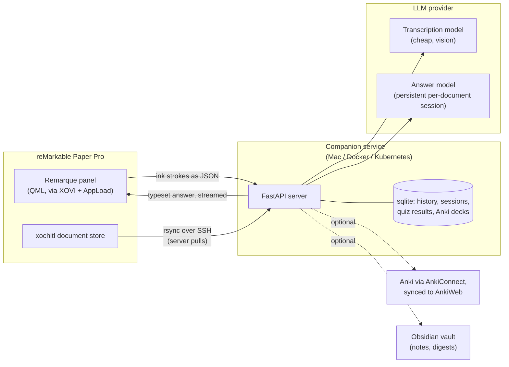

# Remarque

An AI reading assistant for the reMarkable Paper Pro, integrated into the stock PDF viewer.
Handwrite a question with the pen in a floating panel and read a typeset answer, grounded in the open document and your highlights.
A companion service (a Mac during development, or Docker/Kubernetes for self-hosting) syncs documents, extracts text and highlights, and makes the LLM calls - by default through a claude.ai subscription, no API key.

## How it works



The tablet app captures pen strokes and sends them to the server as JSON.
The server pulls documents from the tablet via rsync over SSH, detects the currently open document, transcribes the ink with a cheap vision model, and answers with a strong model inside a persistent per-document session.
Beyond Q&A, the panel offers quick actions, full-text search, quizzing, margin-note context, Anki deck generation, and notes export - see [docs/features.md](docs/features.md).

## Repository layout

- `server/` - Python FastAPI companion service (sync, extraction, providers, all features).
- `device-app/` - QML AppLoad app that runs inside xochitl on the tablet (via XOVI + rm-appload).
- `spike/` - throwaway device app that verifies pen input and networking assumptions.
- `scripts/` - build (Qt rcc via pyside6), deploy (scp), QML validation, desktop simulator.
- `deploy/kubernetes/` - reference Helm chart to vendor into a GitOps repo (this repo never deploys).
- `docs/` - subsystem documentation.

## Quick start

One-time tablet preparation (developer mode, XOVI + AppLoad): see [docs/device.md](docs/device.md).

Run the server on a Mac:

```bash
cd server
cp .env.example .env   # set RM_HOST (tablet LAN IP), SSH_KEY_PATH
uv sync
uv run uvicorn app.main:app --host 0.0.0.0 --port 8000
```

The default provider is `claude-code`: headless Claude Code under your claude.ai subscription, no API key needed.
Other providers (codex, gemini, claude, openai/gateways) and local transcription: [docs/providers.md](docs/providers.md).

Deploy the app to the tablet:

```bash
SERVER_URL=http://<server-ip>:8000 API_TOKEN=<token> DEVICE_HOST=<tablet-ip> ./scripts/deploy-app.sh device-app
```

On the tablet: open a PDF, open the AppLoad menu, and long-press the app icon to launch it windowed over the document.

Run the tests with `cd server && uv run pytest`.
Try everything without the tablet via the desktop simulator: [docs/device.md](docs/device.md).

## Self-hosting

- Docker Compose (one container, state in a named volume): [docs/deployment.md](docs/deployment.md#docker-compose).
- Kubernetes (reference Helm chart, GitOps flow, in-cluster Anki sidecar): [docs/deployment.md](docs/deployment.md#kubernetes).

## Documentation

- [docs/features.md](docs/features.md) - every panel feature and the server behavior behind it.
- [docs/providers.md](docs/providers.md) - LLM providers, sessions and caching, local transcription.
- [docs/deployment.md](docs/deployment.md) - Docker Compose and Kubernetes.
- [docs/device.md](docs/device.md) - device setup, app deployment, spike checklist, simulator, QML validation.
